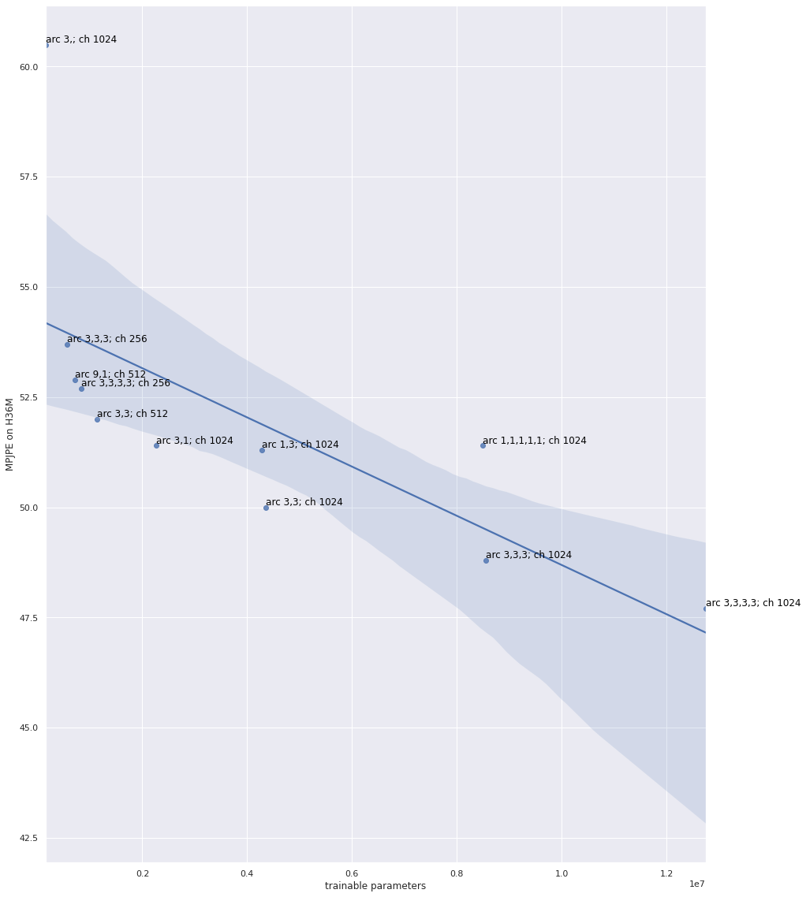

### About
This repo focuses on 3 things:
1. Install Anaconda, Pytorch, Jupyer Notebook, etc. on a brand-new Jeston Nano 2G.
2. Setup, run, and benchmark the original Videopose3D.
3. Optimize models with TensorRT and contrast the inference frame rate before and after optimization.

### Install Dependencies

Jeston Nano uses the aarch64 or arm64 architecture, rather than the widely-adopted x86 architecture. Softwares like Anaconda, Pytorch, Jupyter Notebook, etc. are found to have installation issues following the official instructions. Working installation steps were scattered in forums and blogs around the web, and this document is here to condense them in one place.

TL;DR: How to install Anaconda, Pytorch, Jupyter Notebook, etc. on Jeston Nano 2G.
 
(adpated from https://sahilramani.com/2020/10/how-to-setup-python3-and-jupyter-notebook-on-jetson-nano/)

 
```bash
# update source.list
sudo apt update
sudo apt upgrade

# add cuda executables and libraries to PATH and LD_LIBRARY_PATH
vim ~/.bashrc  # edit the following lines
# export PATH="/usr/local/cuda/bin:$PATH"
# export LD_LIBRARY_PATH="/usr/local/cuda/lib64:$LD_LIBRARY_PATH"

# install miniforge3 (the official anaconda did not work in my case)
wget https://github.com/conda-forge/miniforge/releases/latest/download/Miniforge3-Linux-aarch64.sh
chmod a+x Miniforge3-Linux-aarch64.sh
./Miniforge3-Linux-aarch64.sh
rm ./Miniforge3-Linux-aarch64.sh
bash  # source from .bashrc

# create videopose3d env
conda config --set auto_activate_base false  # not auto-activate the base env
sudo apt install python3-h5py libhdf5-serial-dev hdf5-tools python3-matplotlib
conda create -n videopose3d python=3.6

# install necessary packages to the videopose3d env
conda activate videopose3d
conda install matplotlib numpy tqdm h5py jupyter ipywidgets
# install torch 1.6 
wget https://nvidia.box.com/shared/static/9eptse6jyly1ggt9axbja2yrmj6pbarc.whl -O torch-1.6.0-cp36-cp36m-linux_aarch64.whl
sudo apt install python3-pip libopenblas-base libopenmpi-dev
pip install torch-1.6.0-cp36-cp36m-linux_aarch64.whl
# install torchvision
sudo apt install libjpeg-dev zlib1g-dev
git clone --branch v0.7.0 https://github.com/pytorch/vision torchvision
cd torchvision
export BUILD_VERSION=0.7.0  
vim setup.py  # make change to the following line
# has_ffmpeg = False
python setup.py install
cd ../
pip install 'pillow<7'

# setup the jupyter server
jupyter notebook --generate-config
vim /home/huanx/.jupyter/jupyter_notebook_config.py  # make change to the following lines
# let jupyter listen to the wildcard address, exposing port 8888
# c.NotebookApp.open_browser = False
# c.NotebookApp.ip = '*'
jupyter notebook password  # set password for the jupyter server
python -m ipykernel install --user
```

### Setup, run, and benchmark Videopose3D

VideoPose3D is a lifting network where the input is 2D human pose and the output is 3D human pose. It uses dilated temporal convolution to exploit the information across frames. Here, we will first setup the h36m dataset and pre-trained models for Videopose3D then run evaluation and benchmark the inference speed on h36m.



(adapted from https://github.com/facebookresearch/VideoPose3D/)

```bash
git clone https://github.com/facebookresearch/VideoPose3D.git
cd VideoPose3D

# setup the h36m dataset
cd data
pip install gdown
gdown https://drive.google.com/uc?id=167vFcHP4IKLpwY8FbjYgN54FC3w-V_2g
pip install h5py=='2.9.0'  # videopose3d used a deprecated h5py feature to extract archived data
export HDF5_DISABLE_VERSION_CHECK=1  # mute h5py version warning
python prepare_data_h36m.py --from-archive h36m.zip
# h36m 2d mask-rnn and cpn
wget https://dl.fbaipublicfiles.com/video-pose-3d/data_2d_h36m_cpn_ft_h36m_dbb.npz
wget https://dl.fbaipublicfiles.com/video-pose-3d/data_2d_h36m_detectron_ft_h36m.npz
cd ..

# download pretrained models
mkdir checkpoint
cd checkpoint
wget https://dl.fbaipublicfiles.com/video-pose-3d/pretrained_h36m_cpn.bin
wget https://dl.fbaipublicfiles.com/video-pose-3d/pretrained_humaneva15_detectron.bin
cd ..

# run inference
python run.py -k cpn_ft_h36m_dbb -arc 3,3 -c checkpoint --evaluate h36m_cpn_receptive_9.bin

# benchmark the inference frame rate on Jupyter Notebook

```

### Optimize models with TensorRT

TensorRT boosts the inference speed by systematically lowering precision levels for weights and biases for higher FLOPS. Here, we use Nvidia's torch2trt library to convert Pytorch checkpoints to trt checkpoints. Then, we compare the inference speed before and after optimization. 

(adapted from https://github.com/NVIDIA-AI-IOT/torch2trt/)

```bash
# install torch2trt
pip3 install packaging termcolor
export PYTHONPATH=/usr/lib/python3.6/dist-packages/  # add dist-packages access to the conda env (for accessing the tensorrt package)
git clone https://github.com/NVIDIA-AI-IOT/torch2trt
cd torch2trt
sudo python3 setup.py install
```
